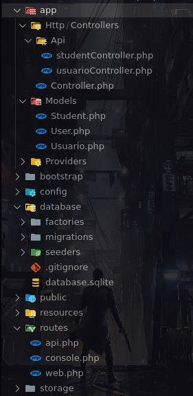
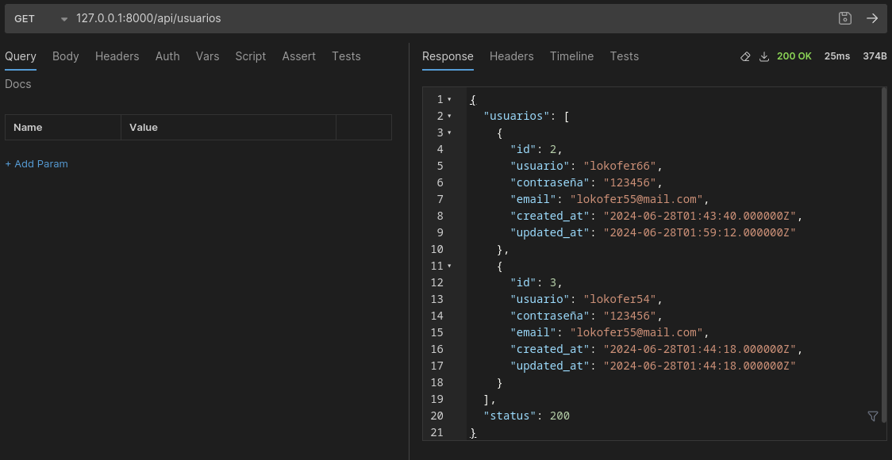
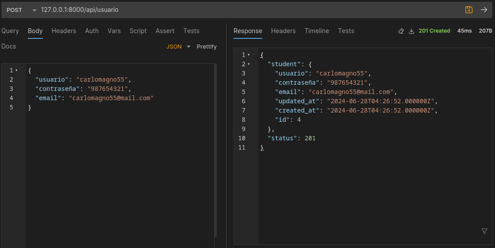
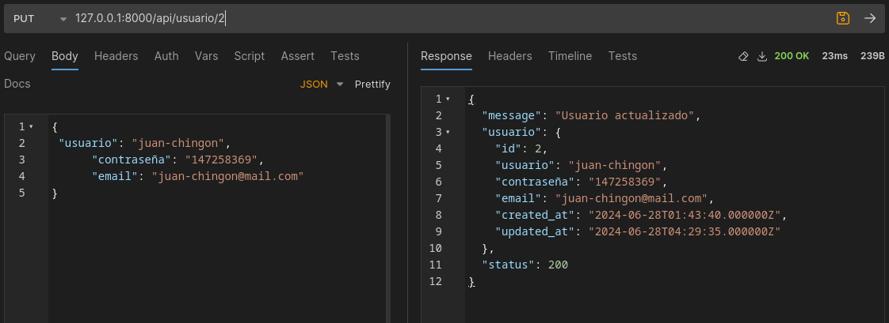
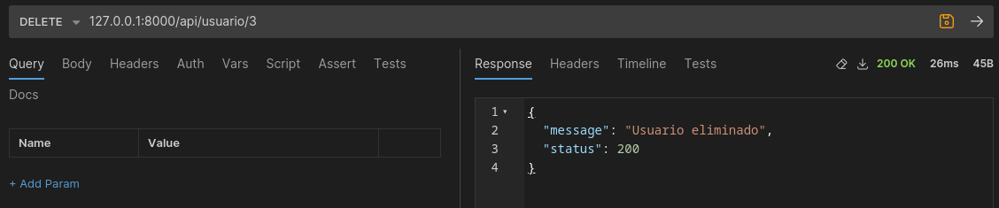

SERVICIO NACIONAL DE APRENDIZAJE

ANÁLISIS Y DESARROLLO DE SOFTWARE (2758333)

Evidencia de desempeño: GA7-220501096-AA5-EV03: Diseño y desarrollo de servicios web - proyecto

PRESENTADO POR: LUIS MIGUEL RODRIGUEZ VARGAS

INSTRUCTOR: ING. FERNANDO FORERO GOMEZ

Tomando como referencia lo visto en el componente formativo “Construcción de API” realizar el diseño y la codificación de las API’s teniendo en cuenta las características del software a desarrollar.
__________________

Estructura del proyecto Laravel

El folder app/Http/Controllers/Api contiene el archivo controlador "usuarioController.php" el cual se encarga de gestionar las solicitudes de los usuarios.

El folder app/Models contiene los archivos ORM (Object-Relational Mapping) que permiten la interacción con las bases de datos relacionales, en este caso la entidad a trabajar se representa con la clase "Usuario.php"

El folder routes/ es donde se definen las rutas o puntos de entrada de la aplicación y vinculan las URL con los controladores y las acciones correspondientes.
__________________

Ejecución local del proyecto

Instalacion "Composer" en Windows https://getcomposer.org/doc/00-intro.md#installation-windows (Composer es una herramienta de gestion de dependencias para proyectos realizado en PHP)

En la raiz del proyecto ejecutar el comando 

    php artisan serve 

        INFO  Server running on [http://127.0.0.1:8000]. 

__________________

Pruebas rutas api

Listar Usuarios 127.0.0.1:8000/api/usuarios 

Crear Usuario 127.0.0.1:8000/api/usuario

Actualizar Usuario 127.0.0.1:8000/api/usuario/2

Eliminar Usuario 127.0.0.1:8000/api/usuario/3

